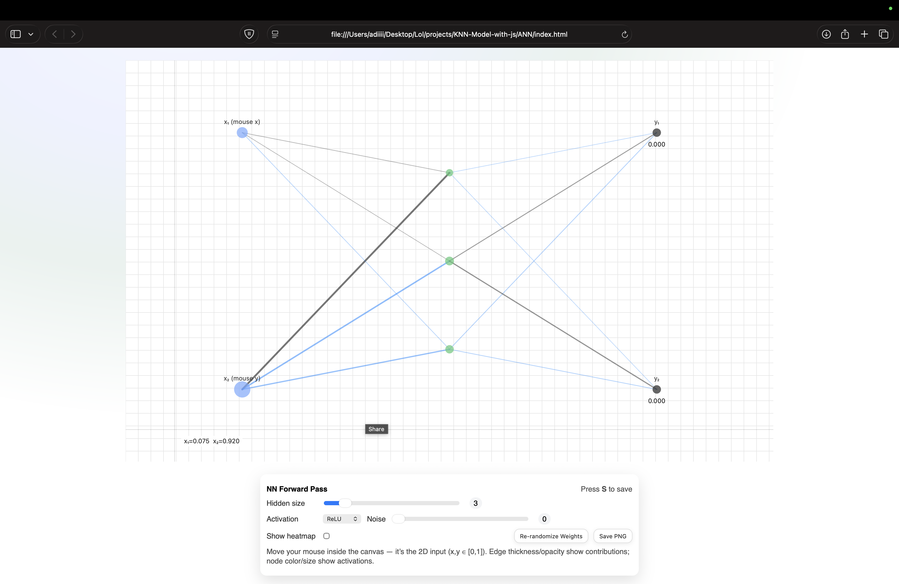
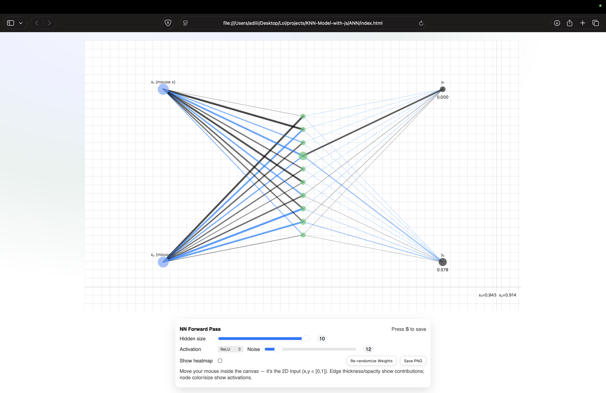
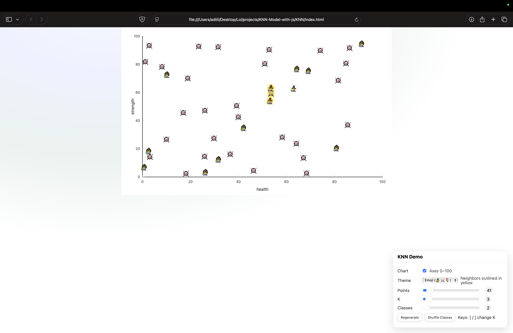
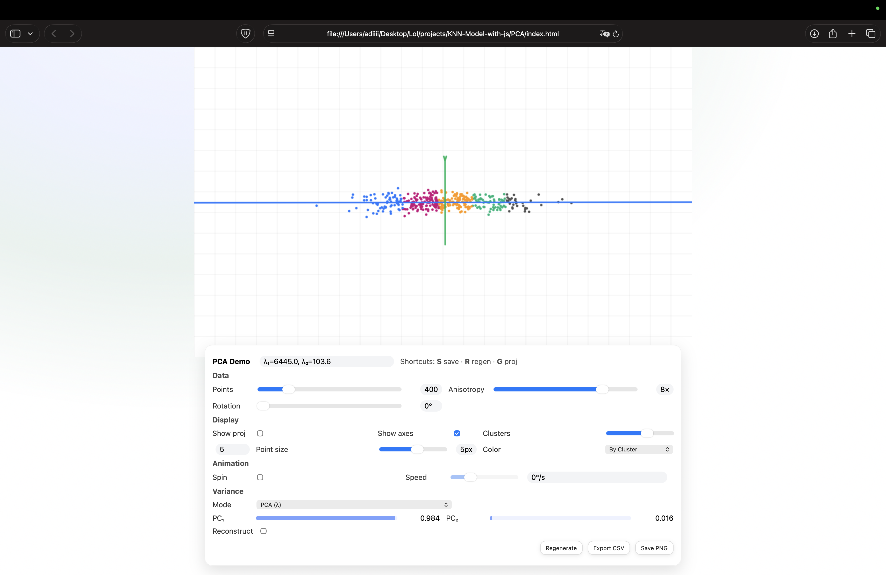
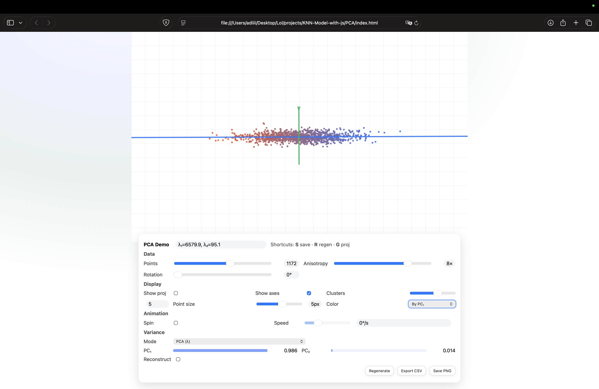
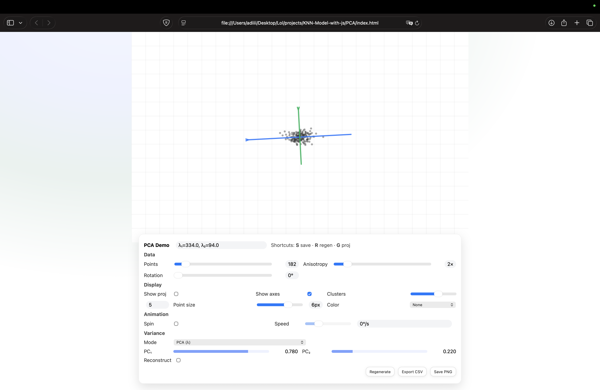

# Interactive Machine Learning Visualizations (p5.js)

This project contains **three interactive demos** built with [p5.js](https://p5js.org/) to help visualize and understand fundamental machine learning concepts:

1. **Neural Network Forward Pass**  
2. **k-Nearest Neighbors (KNN)**  
3. **Principal Component Analysis (PCA)**  

Each demo runs directly in the browser, no backend required.

---
## Screenshots

## ANN 




## KNN


## PCA






---
## 🚀 Getting Started

### Prerequisites
- A modern web browser (Chrome, Firefox, Safari, Edge).  
- [p5.js library](https://cdnjs.cloudflare.com/ajax/libs/p5.js/1.9.0/p5.min.js) is included via CDN.  

### Run Locally
1. Clone or download this repository.  
2. Open any of the HTML files in your browser:  
   - `index.html` (Neural Network demo)  
   - `knn_index.html` (KNN demo)  
   - `pca_index.html` (PCA demo)  

No server setup is required.

---

## 📊 Visualizations

### 1. Neural Network Forward Pass
**File:** `index.html` + `nn.js`

- Visualizes a **2D input (x, y ∈ [0,1])** being passed through a simple feedforward neural network.  
- **Controls:**  
  - Hidden layer size slider (`2–10`)  
  - Activation function: ReLU, tanh, sigmoid  
  - Input noise adjustment  
  - Toggle heatmap overlay  
  - Buttons: *Re-randomize Weights*, *Save PNG*  
- **Interaction:** Move your mouse inside the canvas to see how inputs activate the network.

---

### 2. k-Nearest Neighbors (KNN)
**File:** `sketch.js` + `knn_index.html`

- Demonstrates the **KNN classification algorithm** in 2D.  
- **Controls:**  
  - Toggle chart axes  
  - Theme switch (dots or emoji 🧙⚔️🛡️)  
  - Adjust number of points (`5–500`)  
  - Adjust number of neighbors *K* (`1–50`)  
  - Choose number of classes (`2–5`)  
  - Buttons: *Regenerate*, *Shuffle Classes*  
  - Keyboard shortcuts: `[ / ]` to change K  
- **Interaction:** Add or shuffle points to see how KNN boundaries shift.

---

### 3. Principal Component Analysis (PCA)
**File:** `pca.js` + `pca_index.html`

- Visualizes **dimensionality reduction using PCA**.  
- **Controls:**  
  - Data: number of points, anisotropy, rotation  
  - Display: projection, axes, clusters, point size, color by PC/cluster  
  - Animation: toggle spin & adjust speed  
  - Variance explained bars for PC₁ and PC₂  
  - Buttons: *Regenerate*, *Export CSV*, *Save PNG*  
- **Interaction:** Watch projections update in real-time, explore explained variance.

---

## 📂 Project Structure
```
.
├── ANN
│   ├── index.html
│   └── nn.js
│
├── KNN
│   ├── index.html
│   └── sketch.js
│
├── PCA
│   ├── index.html
│   └── pca.js
│
└── README.md

```

---

## ✨ Features
- Fully interactive, runs directly in browser.  
- Adjustable parameters with **HUD (sliders, checkboxes, dropdowns)**.  
- Export options: save visualizations as PNG or data as CSV (PCA).  
- Clean, modern UI with responsive design.

---

## 📜 License
This project is released under the **MIT License**.  
Feel free to use, modify, and share for learning or teaching purposes.
